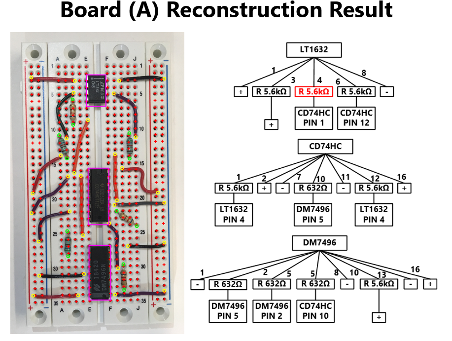

# CS 543/ECE 549 Computer Vision Final Project
# Solderless Dreadboard Debugger
    by: Dongbo Wang, Kexin Hui, Siyan Guo and Ziyun He

## Overview Poster

## Abstract

This project intended to build a solderless breadboard circuit debugger that will take an image of a prototype circuit, detect the locations of circuit elements including wires, resistors and chips, and generate circuit tree schematics. These trees can then be used to check whether the circuit is correct, either by comparing with another image or text input generated by the correct design. Several different methods have been applied to detect and locate different types of circuit elements, including binary segmentation, alignment, circule hough transform, Optical Character Recognition (OCR), etc. The final debugger is able to locate straight or curved wires, locate and classify different resistors, as well as chips with high accuracy, generate circuit tree schematic, compare between circuit trees and show the differences.

## 1. Introduction

Solderless breadboards are widely used tools for circuit engineers to create temporary prototypes and experiment with circuit design. Breadboards have aligned holes on its surface and each row is connected inside the breadboard. One can plug-in various of circuit elements to form a complete circuit.
The task includes detection and classification of certain objects in the image and associate image coordinates with breadboard hole indexes. These include the detection of location of the plug-in holes, endpoint location of wires, location and resistance of resistors, location and type name of IC chips. Using the retrieved information from above, we could then, reconstruct circuit tree schematic, detect difference between schematics.

## 2. Technical Approaches

For most of the parts, this project falls into the categorization of image object detection. The entire project is divided into two major blocks. The first block could be further divided into the detection four major classes: plug-in holes, wires, resistors and chips. The second block is reconstructing the circuit tree and perform equivalence checking. 

### 2.1. Plug-in Holes

The plug-in holes form the fundamental grid restricting the location of all other components on the breadboard. It is crucial to obtain accurate estimation of plug-in holes first. The general strategy is to find the key markers printed on the breadboard like the characters ‘A’ ‘E’ ‘F’ ‘J’ ‘1’ ‘5’ via OCR. Once we obtained the location of these markers, the rough location of the grids could be defined. Individual plug-in holes are detected via circles hough transform. The visible holes location are used to adjust the grid row and column locations. This produces produced a plug-in holes grid with high accuracy.

### 2.2. Wires

Wires are the most basic circuit elements. They are typeless and directionless, defined as a connected area that has roughly the same color. Actually, the detection of wires are similar to the next section of detecting resistors. The key difference is wires are longer and thinner in shapes, so the major and minor axis length, area versus perimeter ratio and the color continuity are used to detect a single wire.

### 2.3. Resistors

Resistors are often found used in circuit design. This project aims to find two most critical parameters, positions of the endpoints and the resistance, in order to build an accurate circuit. A boundary function is performed to partition the preprocessed binary image. The area of each partitioned region is compared with a reference resistor, since almost all resistors have constant shape and volume. In order to avoid faulty results, the width and length are also taken into consideration. After all resistors are successfully found in the image, the next step is to locate the positions of its two endpoints. Centroid, orientation and major axis length of the resistor region are obtained with ‘regionprops’ and used to calculate the exact position of the endpoints. Then resistance is determined according to the color band on the resistors. However, it was hard to read each color band exactly, due to many external factors, such as bright spots caused by light reflection and manufacture differences, etc. The resistors used in this project were limited to two different types, one with 4 color bands and the other with 5 bands. Interpolation is performed across the center of the resistor passing through two endpoints. This tells the color intensity change, namely color band change, so that resistance value can be determined from the two types. 

### 2.4. IC Chips

Integrated circuit chip is often the largest and the most common component in circuit design. They have a lot of functionalities: logical calculation, memory, microprocessor, amplifier etc. They are often of the rectangular shape with 8 or 16 pins on their longer side due to the manufacture. Each IC will have its name and firm name on the top. After preprocessing, the first step is to remove small objects from the binary image due to the relatively large size of the IC. Then perform a morphological close operation on the image with a rectangular-shaped structuring element so that the characters on the top will be filled. The output image now only contains several full rectangle-like shapes. Intuitively, dimensionality and aspect ratio constraints are used to remove false positive results. After localizing the IC chip, the next task is to detect the chip name and direction. Direction, namely pin 1 location, is generally decided by the semi-circle on the top of IC. However due to the texture of the IC, it is not visible on the binary image so instead the orientations of the digits are used to decide the direction of the IC chip. Pin 1 is always located at the bottom-left after placing the IC with the characters in the upright orientation. Finally, OCR is used to detect the characters and pin 1 location. OCR gives confidence value of predicting a digit. Generally, confidence greater than 0.7 indicates accurate recognition of a specific digit. Overall confidence of the recognition of the entire chip will help determine whether or not the chip is flipped.  

### 2.5. Circuit Tree Reconstruction

After the components of the circuit are recognized, the information of the identified objects will be used to construct circuit trees. Since the chips are the essential components of a circuit, a tree is formed for every chip within the circuit. An alternated Breadth First Search (BFS) algorithm is used to construct the circuit tree. That is, for every level of the traversal, the algorithm does the following: First, obtain the front node from the queue and check whether it has reached a termination condition: positive/negative terminal, or a pin of another chip.  If it does reach the termination point, add the leaf node to the tree and terminate the program. If not, obtain its neighbors, add the nodes to the tree and push them onto the queue.

## 3. Final Results and Evaluation

Two circuits were built so that they have different layout and organization. Despite the massive difference in part color, location and orientation, there is only one difference from the view of circuit design, which is the resistance of one resistor connected to the leftmost chip. The debugger is able to reconstruct the circuit correctly and detect the difference between the two circuit.
To test the performance of this debugger, images of the same breadboard that were taken under different conditions are tested. The biggest problem so far is associated with the lighting condition. Huge area of shadows or specular reflections tends to have huge impact on the performance. This is because the adaptive segmentation and OCR tends to have strict requirements on the lighting conditions.

## 4. Future Work
Currently, the circuit prototypes are build with extreme cautious, for all parts sticking to the surface of the breadboard closely and no overlapping occurs in the scene. Also the circuit designs are rather simple. For future works, the debugger could be upgraded to tackle these problems, either by using multiple pictures taken from different views to solve the overlapping problem, or using more sophisticated data structures to represent the circuit and solve for more complex circuits.
